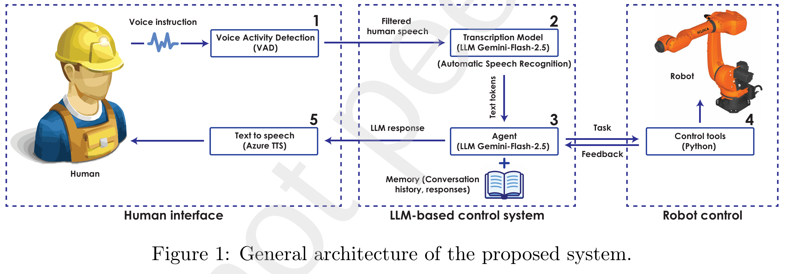

# Robot Voice Control

An LLM-powered robot control system that enables natural language interaction with industrial robots through voice commands or text input.

## System Architecture



The system follows a 5-step pipeline architecture that processes human voice commands into precise robot actions:

1. **Voice Activity Detection (VAD):** Captures and filters human speech from voice instructions.
2. **Speech-to-Text Transcription:** Uses Gemini-Flash-2.5 for automatic speech recognition, converting filtered audio to text tokens.
3. **AI Agent Processing:** The agent processes text input, maintains conversation memory, and generates appropriate robot tasks.
4. **Robot Control Interface:** Python-based control tools execute tasks and provide real-time feedback to the agent.
5. **Text-to-Speech Response:** Azure TTS converts the agent's responses back to speech for seamless human interaction.

This architecture enables bidirectional communication between human and robot through natural language, with persistent memory for context-aware conversations.

## How to Use

### Installation

1. **Clone the repository:**
   ```bash
   git clone https://github.com/Rayen023/RobotVoiceControl.git
   cd RobotVoiceControl
   ```
- **Project Structure:**
   ```
   RobotVoiceControl/
   ├── voice_agent.py                # Voice-controlled interface
   ├── text_agent.py                 # Text-based interface
   ├── src/
   │   ├── agent_common.py           # Shared agent configuration
   │   ├── agent_tools.py            # Robot control tools and functions
   │   ├── robot_control.py          # Core robot communication
   │   ├── tts.py                    # Text-to-speech implementation
   │   ├── simple_emotion_detector.py# Emotion recognition
   │   └── tech_doc.md               # RAG Technical documentation for KUKA
   ├── docs/
   │   └── images/
   │       └── architecture.png      # System architecture diagram
   └── pyproject.toml                # Project dependencies
   ```

2. **Install dependencies using uv:**
   ```bash
   uv sync
   ```

3. **Configure environment variables:**
   Create a .env file in the root directory with the following API keys:
   ```env
   # Azure Speech Services (for Text-to-Speech)
   AZURE_SUBSCRIPTION_KEY=your_azure_subscription_key
   AZURE_REGION=your_azure_region

   # Google GenAI (for Speech-to-Text)
   GOOGLE_API_KEY=your_google_api_key

   # OpenRouter (for the main AI agent)
   OPENROUTER_API_KEY=your_openrouter_api_key
   OPENROUTER_BASE_URL=https://openrouter.ai/api/v1
   ```

### Running the Application

**Voice Control Mode:**
```bash
python voice_agent.py
```

**Text Control Mode:**
```bash
python text_agent.py
```

### LLM-Powered Interaction

- **Natural Language Processing:** Understands robot commands in conversational language.
- **Context Awareness:** Maintains conversation history and robot state.
- **Multi-modal Input:** Supports both voice and text commands.
- **Command Translation:** Converts natural language to robot instructions.
- **Error Recovery:** Robust error handling and automatic retry mechanisms.
- **Modular Architecture:** Easily integrates new tools and capabilities.
- **Real-time Feedback:** Provides live position monitoring and status updates.

### KRL (KUKA Robot Language) Integration

The system establishes communication with the robot using:

- **Primary Communication:** Telnet connection for sending KRL (KUKA Robot Language) commands.
- **Monitoring:** py-openshowvar library for reading robot variables and positions.
- **Vision Integration:** HTTP/FTP communication with Cognex vision systems.

The system generates and executes KRL commands for:

- **Position Control:** Cartesian and joint space movements (linear and point-to-point).
- **Joint Movements:** Precise angular positioning with real-time feedback.
- **Pick and Place Operations:** Automated object manipulation with gripper control.
- **Home Position Initialization:** Safe startup and reference positioning.
- **Real-time Position Monitoring:** Continuous status updates and position tracking.
- **Safety Monitoring:** Real-time position feedback and collision avoidance.
- **Vision Integration:** Object detection via Cognex cameras.
